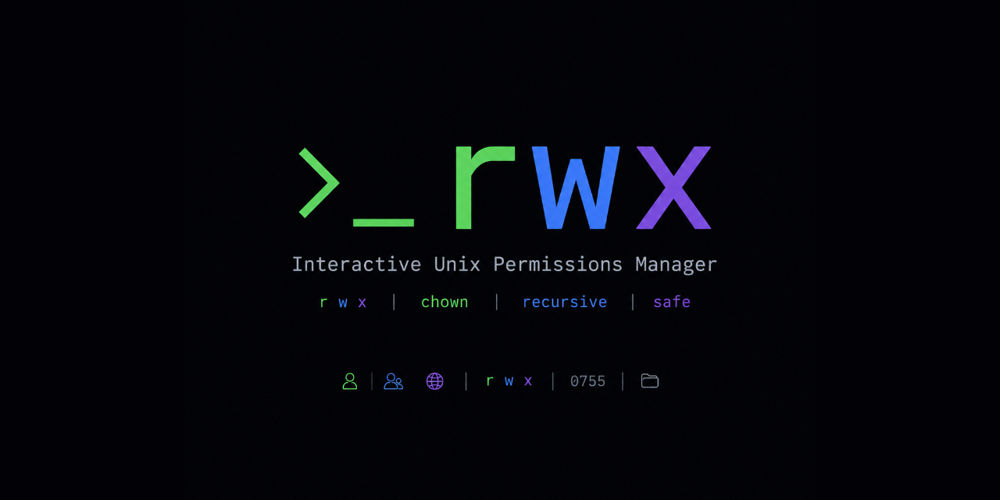

# rwx

An interactive Unix file permissions and ownership TUI manager built in Rust with [Ratatui](https://github.com/ratatui/ratatui) and [crossterm](https://github.com/crossterm-rs/crossterm).

`rwx` simplifies inspect/audit operations on files and folders, enabling developers and administrators to quickly visualize permissions, toggle individual bits interactively, change owners/groups, and safely apply changes recursively.



---

## Features

- **Interactive File Browser**: Navigate directories, inspect file sizes, and select files or directories directly within the interface.
- **Dual Permission Editors**:
  - **Permissions Grid (Checkboxes)**: Easily toggle Read (`r`), Write (`w`), and Execute (`x`) rights across Owner (`u`), Group (`g`), and Others (`o`).
  - **Direct Octal Input**: Type octal numbers directly (e.g., `0755`, `4755`, `1777`) with real-time validation.
- **Special Bits Support**: Inspect and configure SetUID, SetGID, and Sticky bits.
- **Ownership Management**: Modify target owner and group names (using `chown` and `chgrp` under the hood) with live user/group existence validation.
- **Recursive Mode**: Toggle recursive changes to automatically apply the permissions and ownership to all files and directories nested under the target.
- **Real-Time Previews**: Instantly view the symbolic permission representation (e.g., `drwxr-xr-x` or `-rwsr-xr-x`) as you edit.
- **Panic Resilience**: Registers custom panic hooks to automatically restore your terminal state (raw mode, screen buffering) in case of unexpected errors.

---

## Installation

### 1. Homebrew (macOS & Linux)
You can install `rwx` using Homebrew via our custom tap:
```bash
brew install vncsmnl/tap/rwx
```

### 2. Shell Script (macOS & Linux)
Install the pre-compiled binary via a shell script:
```bash
curl --proto '=https' --tlsv1.2 -LsSf https://github.com/vncsmnl/rwx/releases/latest/download/rwx-installer.sh | sh
```

### 3. From Crates.io
Since `rwx` is published on [crates.io](https://crates.io/crates/rwx), you can install it using Cargo:
```bash
cargo install rwx
```

### 4. Pre-compiled Binaries (Cargo Binstall)
If you have `cargo-binstall` installed, you can quickly download and install pre-compiled binaries directly:
```bash
cargo binstall rwx
```

### 5. Building from Source
If you want to compile `rwx` yourself:

#### Prerequisites
- **Rust and Cargo** (2024 Edition) installed on your system.
- A Unix-like operating system (macOS, Linux, BSD) because the tool relies on Unix-specific features.

```bash
git clone https://github.com/vncsmnl/rwx.git
cd rwx
cargo build --release
sudo cp target/release/rwx /usr/local/bin/
```

---

## Usage

Start `rwx` in the current directory:

```bash
rwx
```

Or open a specific file or directory directly in the Editor mode:

```bash
rwx /path/to/file_or_directory
```

### CLI Arguments

```bash
rwx [FLAGS] [PATH]

Arguments:
  [PATH]         Path to the file or directory to inspect/edit

Flags:
  -R, --recursive  Apply changes recursively (when target is a directory)
  -h, --help       Print help information
  -V, --version    Print version information
```

---

## Keybindings

### 1. Browser Mode (File Explorer)

Use Browser Mode to navigate the file system and choose a file/directory to edit.

| Key | Action |
| :--- | :--- |
| `↑` / `k` | Move selection up |
| `↓` / `j` | Move selection down |
| `Enter` | Enter a directory, or open a file/directory in the Editor |
| `S` | Open the current directory itself in the Editor |
| `Esc` / `q` | Quit the application |

### 2. Editor Mode

In Editor Mode, you modify permissions, ownership, and options.

| Key | Action |
| :--- | :--- |
| `↑`, `↓`, `←`, `→` / `h`, `j`, `k`, `l` | Move focus around the interface (grid, inputs, buttons) |
| `Tab` / `Shift+Tab` | Cycle focus forward / backward |
| `Space` / `Enter` | Toggle the selected checkbox, or activate the focused button |
| `0-7` (while on Octal input) | Edit the octal permission value directly |
| `Backspace` (while on Owner/Group input) | Delete characters |
| `Esc` | Cancel input field editing, or quit if not editing |
| `B` / `Backspace` (outside inputs) | Go back to the File Browser |
| `A` | Apply pending changes |
| `Q` | Quit the application |

---

## Project Structure

- [`src/main.rs`](src/main.rs): Application entry point, CLI arguments parsing, and terminal setup/event loop.
- [`src/app.rs`](src/app.rs): Core application state management, file system queries, validation logic, and directory walking.
- [`src/permissions.rs`](src/permissions.rs): Permission data structures, converters between octal, mode, and symbolic formats, and unit tests.
- [`src/ui.rs`](src/ui.rs): TUI drawing definitions using Ratatui layout blocks, tables, lists, text styled elements, and message modals.

---

## License

This project is licensed under the MIT License. See the [LICENSE](LICENSE) file for details.
